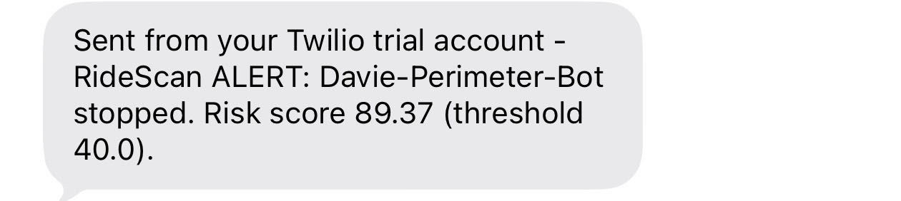

# davie-ridescan-integration
A production-grade ROS 2 integration for the RideScan Safety Layer API: telemetry bridge, risk diagnostics, and autonomous safety response for mobile robots.

## Problem & Solution : Why RideScan

**The problem:** Autonomous robots deployed for repetitive, unsupervised work .. like warehouse perimeter inspection  degrade silently. Hardware wear, sensor drift, wheel slip, and minor obstacle encounters build up gradually and rarely trip a hard fault in the robot's own control stack. Traditional monitoring is binary (the robot either completes its mission or crashes) or reactive (someone reviews logs after something has already gone wrong). By the time a problem becomes visible through conventional means, a safety incident, a missed anomaly, or hardware damage may have already occurred ,  and there's no way to compare "how the robot is behaving today" against "how it behaved when it was healthy."

**The solution:** This integration treats RideScan as an independent behavioral safety layer sitting above the robot's own navigation stack, rather than as a logging add-on. Fifteen clean calibration runs teach RideScan what a healthy perimeter inspection looks like velocity profile, obstacle clearance, heading changes, motor command patterns across every phase of the mission. In live operation, telemetry is streamed to RideScan's inference API in near real time, and any run that drifts meaningfully from that learned baseline is converted into a quantified risk score. When that score crosses the critical threshold, the robot autonomously halts itself and a human operator is alerted by SMS. This closes the loop between *detection* and *action*: RideScan doesn't just tell you something looks off after the fact, it stops the robot the moment it does.

## Robot Mission Selection Reasoning

**Why warehouse perimeter inspection:** This is one of the highest-frequency real-world autonomous robot deployments (50–200 loops per day per facility), so a calibration/inference pipeline built for it maps directly onto commercial use cases rather than being a synthetic demo. It also has a naturally repeatable, loopable route, which is exactly what a calibration-based safety layer needs ... RideScan can only learn "normal" from a mission that has a clear, repeatable shape.

**Why a fixed 5-waypoint loop:** A route with distinct dock-exit, straight-segment, turn, arrival, and return phases gives RideScan several behaviorally different sub-phases to learn from within a single run, rather than one flat, undifferentiated signal. Five waypoints was chosen as the minimum needed to exercise straight-line cruising and cornering behavior without making the 15-run calibration pass (a hard prerequisite before any inference is possible) too time-consuming to collect.

**Why a differential-drive robot (Davie):** Differential drive is the simplest robot model that still produces a realistic velocity/heading/turn signature, letting the mission focus on the RideScan integration itself rather than on kinematics. It also reuses a Nav2 + SLAM Toolbox stack already proven in earlier simulation work, reducing the number of new variables introduced during a time-boxed hackathon stage.

**Why simulation (Gazebo) over hardware:** Simulation gives deterministic, repeatable starting conditions across all 15 calibration runs the same route, same environment, same starting pose every time  so any variation RideScan sees in the baseline is close to pure floating-point/path-execution noise rather than real-world variability. That produces a tight, precise behavioral fingerprint, which is the right target for a calibration baseline, and it removes hardware availability as a constraint on the submission timeline.

## Data Collection & API Integration Strategy

**Stage 2 — calibration data strategy:** Telemetry is captured from exactly three ROS 2 topics — `/odom`, `/scan`, and `/cmd_vel` — chosen because together they cover position/heading, environment geometry, and commanded motion, which is enough to reconstruct the full behavioral signature of a run without over-instrumenting the robot. Each of the 15 calibration runs is written as one complete CSV per mission instance, giving RideScan a clean one-file-per-run structure to calibrate against.

**Stage 3 — live inference strategy:** The same three-signal telemetry model carries over unchanged from Stage 2 so the Stage 2 baseline stays valid for Stage 3 inference — nothing about the signal set changes between calibration and live scoring. What changes is the batching strategy: instead of one CSV per full mission run, telemetry is buffered into rolling 30-second batches and uploaded continuously via the `process_file` endpoint, which is what makes near-real-time risk scoring possible during an in-progress mission rather than only after it ends.

**API efficiency and resilience:**
- Acceleration is derived via finite difference of consecutive `/odom` velocity readings rather than subscribing to a dedicated IMU topic, avoiding an extra sensor dependency for a value the API needs.
- A `_processing` guard prevents overlapping batch cycles from firing concurrent uploads if a `process_file` call runs long.
- 502 gateway errors are handled defensively: rather than assuming an upload failed, the node checks whether the file actually landed on the server before treating it as a real failure, avoiding false-negative retries that could waste an API call or duplicate data.
- The 30-second batch interval is the deliberate trade-off point between responsiveness (how quickly a risk event can be caught) and API call volume (avoiding streaming every single telemetry row individually).

## Execution

**Why this run order matters:** The safety monitor node is always started *before* the waypoint follower so there is no telemetry gap at the start of a mission ...if the monitor started late, the first seconds of dock-exit behavior (one of the phases RideScan explicitly calibrates against) would go unscored. Similarly, the visualiser is optional precisely because it only renders what the monitor and follower already publish; it never gates the safety loop itself.

**How one full execution cycle plays out end to end:**
1. The safety monitor comes online and starts buffering `/odom` telemetry immediately.
2. The waypoint follower begins driving Davie through the 5-point perimeter loop.
3. Every 30 seconds, the buffered batch is written to a temporary CSV and uploaded to RideScan's inference endpoint.
4. RideScan returns a risk score for that batch.
5. The score is published to `/ridescan/risk_score` and appears live in the path visualiser and on the RideScan dashboard.
6. If the score is at or above the configured threshold, `True` is published to `/ridescan/safety_stop`.
7. The waypoint follower immediately zeroes `/cmd_vel` and pauses navigation — the mission does not silently continue on a flagged run.
8. A Twilio SMS fires to the operator the moment the stop is triggered, and a second SMS fires on recovery once the score drops back below threshold.
9. The anomaly position and score are logged and rendered as a red diamond marker on the live plotter.
10. The dashboard at `hackathon.ridescan.cloud` updates with the new execution cycle, so the full history of runs is auditable after the fact as well.

This is why the system is described as closed-loop rather than log-only: every one of these ten steps happens automatically, without an operator having to watch a terminal or manually decide to stop the robot.

## Nodes

### 1. `ridescan_bridge_node`

The telemetry extraction and upload layer. Subscribes to `/odom`, `/scan`,
and `/cmd_vel`, batches the telemetry into timestamped CSV files, and
uploads them to a RideScan robot mission.

In RideScan's architecture terms, this node is what produces the Mission
Instance files. Every time the robot completes one mission run, this node
has been silently recording everything and writes it out as one clean CSV
representing that single run.

- Registers the robot and mission on RideScan automatically on first upload
- Batches telemetry rows into CSV files every 60 seconds
- Uploads each CSV to RideScan as a mission file
- Flushes remaining data to disk on shutdown so no telemetry is lost
- The mode writes CSVs locally without uploading

**Terminal 1 start the bridge node first and leave it running:**
```bash
ros2 run ridescan_ros2_bridge ride_scan_csv_node
```

**Terminal 2 run the mission:**
```bash
for i in {1..15}; do
  echo "Starting calibration run $i of 15..."
  ros2 run ridescan_ros2_bridge way_point_follower_node
  echo "Run $i complete."
  sleep 2
done
```

**Alternative one bridge per run (cleanest CSV-per-run boundary):**
```bash
for i in {1..15}; do
  echo "Starting calibration run $i of 15..."
  
  # start bridge node in background
  ros2 run ridescan_ros2_bridge ride_scan_csv_node &
  BRIDGE_PID=$!
  
  # run one mission
  ros2 run ridescan_ros2_bridge way_point_follower_node
  
  # kill bridge node destroy_node() flushes remaining rows to CSV
  kill $BRIDGE_PID
  
  echo "Run $i complete. CSV written."
  sleep 3
done
```

---

### 2. `way_point_follower_node`

The mission execution layer. Sends Davie through a fixed waypoints
perimeter loop.

**The route (warehouse perimeter inspection):**

One full execution of this script = one complete mission run. Run it 15
times (alongside `ridescan_bridge_node`) to produce the calibration
baseline dataset.

```bash
ros2 run ridescan_ros2_bridge way_point_follower_node
```

**Role in the Stage 2 calibration setup:**
This is the node that generates the consistent, repeatable navigation
behavior that `ridescan_bridge_node` records as telemetry. Run it 15 times
with the bridge running alongside, and together they produce the calibration
baseline dataset one complete perimeter inspection per run, captured as a
timestamped CSV.

---

## Mission Briefing

### What is the Mission?

The mission is a **Warehouse Perimeter Inspection** executed by Davie,
a simulated differential-drive mobile robot running on ROS 2 Humble and
Gazebo Sim. Starting from a fixed dock position, Davie navigates
autonomously through 5 predefined waypoints that trace the boundary of a
simulated warehouse environment, then returns to its origin.

The mission is executed entirely autonomously via the `way_point_follower_node`,
which sends each waypoint , waits for
confirmed arrival, then proceeds to the next. No manual intervention is
required between waypoints. Each run is identical in route, speed, and
behavior producing a clean, repeatable telemetry baseline across all 15
calibration instances.

### Real-World Commercial Use Case

Warehouse perimeter inspection is one of the highest-frequency autonomous
robot deployments in operation today. In real-world facilities, robots patrol
boundaries, monitor access points, detect environmental anomalies, verify
asset placement, and flag unauthorized activity all without human
supervision, across multiple shifts, every single day.

The scale of this problem is significant:
- A single warehouse may run 50–200 inspection loops per day
- Robots operate unsupervised for hours at a time
- Hardware degradation is gradual and often invisible until failure
- A single missed anomaly can escalate into a mission failure, hardware
  loss, or a safety incident

Real-world deployments this mission maps directly to:

| Industry | Application |
|---|---|
| Warehouse automation | Amazon Robotics, Fetch Robotics, 6 River Systems |
| Facility security | Access point monitoring, perimeter patrol |
| Industrial inspection | Oil & gas plants, manufacturing floors |
| Healthcare | Hospital corridor patrol, asset tracking |
| Hospitality | Hotel and office campus delivery and monitoring |


---

## System Architecture

The following diagram illustrates the end-to-end flow of the Davie–RideScan
integration, from autonomous mission execution in simulation through
telemetry extraction, calibration, and future risk scoring.

```text
                    Gazebo Sim
                         │
                         ▼
                    Waypoint Follower
                         │
                         ▼
               Davie Executes Mission
                         │
        ┌────────────────┼────────────────┐
        │                │                │
        ▼                ▼                ▼
     /odom            /scan           /cmd_vel
        │                │                │
        └────────────────┼────────────────┘
                         │
                         ▼
              ridescan_bridge_node
                         │
                         ▼
                Mission CSV Files
                  (15 Instances)
                         │
                         ▼
              RideScan Calibration
              (Baseline Learning)
                         │
                         ▼
               Future RISQ Scoring
               (Inference Phase)
```

During calibration, the telemetry collected from each mission execution is
persisted as a separate Mission Instance CSV. RideScan uses these 15 clean,
near-identical mission instances to learn the robot's normal behavioral
fingerprint. Once deployed, future mission runs can be compared against this
baseline to quantify operational risk and detect early signs of anomalous
behavior.


### How RideScan Monitors This Mission

RideScan acts as an independent safety and reliability layer a behavioral
health monitor that learns what a normal, healthy inspection run looks like
and flags any deviation as a quantified risk signal.

**Step 1 Telemetry Collection**

During every mission run, `ridescan_bridge_node` collects timestamped
telemetry from three ROS 2 topics:

| Signal | Topic | What It Captures |
|---|---|---|
| Odometry | `/odom` | Position, velocity, heading per timestep |
| Laser scan | `/scan` | Obstacle distances, environment geometry |
| Velocity commands | `/cmd_vel` | Motor commands, speed profile per segment |

Each run produces one CSV file one Mission Instance in RideScan's
architecture.

**Step 2 Calibration (Learning Normal Behavior)**

15 clean, sequential runs of the identical mission are collected under
consistent conditions. RideScan processes these 15 files to learn the
robot's normal behavioral envelope:
- Expected velocity profile between each waypoint
- Typical obstacle distances along the route
- Normal odometry progression and heading changes
- Baseline motor command patterns

---

### What the Calibration Files Do

Each CSV file is a complete behavioral record of one mission run. Together, the 15 files form the dataset RideScan uses to learn what normal looks like for this robot on this mission.

**What each file contains:**

Every row in a CSV is a timestamped telemetry message from one of three ROS 2
topics, captured in real time as Davie navigated the perimeter loop. A single
run produces hundreds of rows interleaving `odom`, `scan`, and `cmd_vel`
messages across the full mission duration.


**What RideScan learns from them:**

By processing all 15 files, RideScan builds a statistical model of normal behavior across every phase of the mission:

| Phase | What the files capture |
|---|---|
| Dock exit | Initial acceleration profile, heading establishment |
| Straight segments | Cruise velocity, obstacle clearance distances, heading stability |
| Waypoint turns | Angular velocity ramp-up and ramp-down signature, turn radius |
| Waypoint arrival | Deceleration profile, stop position accuracy |
| Return to dock | Full route odometry progression, cumulative heading change |

**Why 15 runs:**

A single run could be noise. Two or three runs could share a systematic bias. Fifteen runs gives RideScan enough samples to distinguish genuine behavioral patterns from run-to-run variation, producing a statistically robust baseline. Any future run that deviates meaningfully from this envelope will be flagged as a quantified risk signal rather than dismissed as natural variance.

### What constitutes one clean run

- Davie successfully navigates all 5 waypoints without aborting
- The bridge node is active for the full duration of the run
- No unexpected obstacles or environment changes during the run
- One CSV file is written per run on bridge shutdown


### Calibration Setup and Consistency

The 15 calibration runs in this dataset were collected under controlled,
deterministic conditions. This was a deliberate design decision to give
RideScan the cleanest possible baseline to learn from.

**What this means for RideScan:**

Because every run follows the same route from the same starting position in
the same environment, the behavioral variation between runs is minimal
limited only to minor floating-point differences in how Nav2 executes the
path at runtime.

RideScan does not have to account for algorithmic randomness or shifting
starting conditions when building the baseline.

The result is a tight, precise behavioral fingerprint rather than a wide,
averaged envelope.

Each of the three telemetry signals tells nearly the same story across all
15 runs:

| Signal | What stays consistent across runs |
|---|---|
| `/odom` | Position progression, velocity profile, heading changes at each waypoint |
| `/scan` | Obstacle distances at each route segment, environment geometry |
| `/cmd_vel` | Motor command patterns, acceleration and deceleration profiles, turn signatures |

This consistency is what makes the calibration baseline reliable. When
RideScan flags a future run as anomalous, it is comparing against a baseline
built from runs that were as close to identical as simulation allows not a
baseline built from runs that were each slightly different by design.

---

---

# Stage 3 — Live API Integration & Autonomous Safety Response

## Overview

Stage 3 transforms the calibration pipeline built in Stage 2 into a fully
operational, real-time safety system. Where Stage 2 produced the behavioral
baseline, Stage 3 puts that baseline to work: live telemetry from Davie's
ongoing missions is streamed to RideScan's inference API, risk scores are
returned in real time, and the robot responds autonomously to any score that
breaches the critical threshold.

The result is a closed-loop autonomous safety system:

```text
Robot moves → Telemetry streams → RideScan scores risk →
Score breaches threshold → Safety stop triggers → Human operator alerted via SMS
```

This is not a logging pipeline. Every component in Stage 3 closes a real
operational loop — the robot makes autonomous decisions based on live API
intelligence, and a human is notified the moment something goes wrong.

---

## Stage 3 Architecture

```text
                        Gazebo Sim
                             │
                             ▼
                        Waypoint Follower
                             │
                             ▼
                   Davie Executes Mission
                             │
               ┌─────────────┼─────────────┐
               │             │             │
               ▼             ▼             ▼
            /odom         /scan        /cmd_vel
               │             │             │
               └─────────────┼─────────────┘
                             │
                             ▼
              ridescan_safety_monitor_node
              (buffers telemetry → CSV batch)
                             │
                             ▼
                  RideScan Inference API
                  (process_file endpoint)
                             │
                             ▼
                      Risk Score Returned
                             │
               ┌─────────────┼─────────────┐
               │             │             │
               ▼             ▼             ▼
        /ridescan/      /ridescan/       Twilio
        safety_stop     risk_score      SMS Alert
               │
               ▼
     way_point_follower_node
     (halts robot on True)
```

---

## Stage 3 Nodes

### 1. `ridescan_safety_monitor_node`

The core of the Stage 3 integration. This node buffers live odometry into
rolling CSV batches, uploads each batch to RideScan's `process_file`
endpoint, triggers inference, and publishes a safety stop signal if the
returned risk score exceeds the configured threshold.

**Responsibilities:**
- Subscribes to `/odom` and buffers telemetry rows in memory
- Computes linear acceleration via finite difference of consecutive velocity
  readings, approximating IMU-derived acceleration without requiring a
  physical IMU topic
- Every `batch_seconds` (default: 30s), writes the buffer to a temporary CSV
  and uploads it to RideScan
- Calls the inference endpoint and polls until a risk score is returned
- Publishes the risk score to `/ridescan/risk_score` (Float32)
- If `risk_score >= risk_threshold`, publishes `True` to `/ridescan/safety_stop` (Bool)
- Fires an SMS alert via Twilio on both safety stop and recovery events
- Handles 502 gateway errors gracefully — verifies whether the file actually
  landed on the server before treating the upload as a genuine failure
- Guards against overlapping batch cycles with a `_processing` flag

**Key parameters:**

| Parameter | Default | Description |
|---|---|---|
| `api_key` | `$RIDESCAN_API_KEY` | RideScan API key |
| `robot_id` | `e.......` | Registered robot UUID |
| `mission_id` | `5.......` | Active mission UUID |
| `robot_type` | `wheeled_mobile` | Robot classification |
| `batch_seconds` | `30.0` | Telemetry batch interval |
| `risk_threshold` | `40.0` | Safety stop trigger level |

**Topics published:**

| Topic | Type | Description |
|---|---|---|
| `/ridescan/safety_stop` | `std_msgs/Bool` | True when risk exceeds threshold |
| `/ridescan/risk_score` | `std_msgs/Float32` | Latest batch risk score |

**Topics subscribed:**

| Topic | Type | Description |
|---|---|---|
| `/odom` | `nav_msgs/Odometry` | Robot pose and velocity |

---

### 2. `way_point_follower_node` (Stage 3 extension)

The mission execution layer, extended in Stage 3 to subscribe to
`/ridescan/safety_stop`. When the safety monitor publishes `True`, the
waypoint follower immediately halts the robot by publishing a zero-velocity
`Twist` to `/cmd_vel` and suspends further waypoint navigation until the
stop is cleared.

This is the mechanism that closes the loop — the API's risk assessment
directly controls whether the robot continues its mission.

**Safety stop behavior:**
- Receives `Bool` on `/ridescan/safety_stop`
- On `True`: publishes zero `Twist` to `/cmd_vel`, pauses waypoint execution
- On `False` (recovery): resumes mission from current waypoint
- Logs all stop and resume events with the associated risk score

---

### 3. `odom_live_plot_path` (Visualisation Node)

A real-time matplotlib visualiser that renders Davie's path as the mission
executes. Anomaly events from the safety monitor are overlaid as red diamond
markers at the exact coordinates where the risk score exceeded the threshold.

**What the plot shows:**

| Element | Description |
|---|---|
| Blue line | Live robot trajectory |
| Red dot | Current robot position (updates at 100ms) |
| Green triangle | Mission start position |
| Black × | Predefined waypoints |
| Red diamonds | Anomaly positions (risk ≥ threshold) |
| Title bar | Live sample count, total distance, anomaly count |

The node uses `rclpy.spin_once()` inside matplotlib's `FuncAnimation`
callback, allowing ROS callbacks and the GUI to share a single thread
without blocking.

**Topics subscribed:**

| Topic | Type | Description |
|---|---|---|
| `/odom` | `nav_msgs/Odometry` | Robot position for path rendering |
| `/ridescan/risk_assessment` | `std_msgs/String` | Anomaly events for overlay markers |

---

## SMS Alerting — Twilio Integration

Stage 3 integrates Twilio as the SMS alerting provider. When the safety
monitor detects a risk score above threshold, an SMS is dispatched
immediately to the configured operator number. A second SMS is sent when
the risk score drops back below threshold and the robot resumes.

**Alert messages:**

| Event | SMS Content |
|---|---|
| Safety stop triggered | `RideScan ALERT: Davie-Perimeter-Bot stopped. Risk score {score} (threshold {threshold}).` |
| Robot resumed | `RideScan: Davie-Perimeter-Bot resumed. Risk score {score} back below threshold.` |

**Setup:**

```bash
pip install twilio --break-system-packages
```

```bash
export TWILIO_ACCOUNT_SID=your_account_sid
export TWILIO_AUTH_TOKEN=your_auth_token
export TWILIO_FROM_NUMBER=your_twilio_phone_number
export TWILIO_TO_NUMBER=your_phone_number
```

The SMS integration is non-blocking — a failure to send does not interrupt
the safety stop logic or the mission. Errors are logged to the ROS console
only.

---

### SMS Safety Alert

The integration sends an SMS notification to the operator whenever RideScan
returns a risk score above the configured threshold and the robot performs
an autonomous safety stop.



*Figure: SMS alert indicating that Davie_Perimeter_Bot was stopped after a RideScan risk score.*

---

## Environment Variables

All credentials are loaded from environment variables. Never hardcode keys.

```bash
# RideScan
export RIDESCAN_API_KEY=your_ridescan_api_key

# Twilio
export TWILIO_ACCOUNT_SID=your_account_sid
export TWILIO_AUTH_TOKEN=your_auth_token
export TWILIO_FROM_NUMBER=your_twilio_phone_number
export TWILIO_TO_NUMBER=your_phone_number
```

Add these to `~/.bashrc` for persistence:

```bash
echo 'export RIDESCAN_API_KEY=your_key' >> ~/.bashrc
echo 'export TWILIO_ACCOUNT_SID=your_sid' >> ~/.bashrc
echo 'export TWILIO_AUTH_TOKEN=your_token' >> ~/.bashrc
echo 'export TWILIO_FROM_NUMBER=your_twilio_number' >> ~/.bashrc
echo 'export TWILIO_TO_NUMBER=your_phone_number' >> ~/.bashrc
source ~/.bashrc
```

---

## Running the Full Stage 3 Stack

Four terminals are required for a complete Stage 3 run:

**Terminal 1 — Gazebo simulation:**
```bash
ros2 launch robot gazebo_sim.launch.py
```

**Terminal 2 — Safety monitor (start first, before the mission):**
```bash
ros2 run ridescan_ros2_bridge ridescan_safety_monitor_node
```

**Terminal 3 — Waypoint follower (mission execution):**
```bash
ros2 run ridescan_ros2_bridge way_point_follower_node
```

**Terminal 4 — Live path visualiser (optional but recommended):**
```bash
ros2 run ridescan_ros2_bridge odom_plotter_node
```

**Expected sequence of events:**
1. Safety monitor starts and begins buffering odometry
2. Waypoint follower sends Davie through the perimeter loop
3. Every 30 seconds, a telemetry batch is uploaded to RideScan
4. RideScan returns a risk score
5. Score is published to `/ridescan/risk_score` and visible in the plotter
6. If score ≥ threshold, `True` is published to `/ridescan/safety_stop`
7. Waypoint follower halts the robot
8. Twilio SMS alert fires to the operator number
9. Risk score and anomaly position are logged and rendered on the plotter
10. Dashboard at `hackathon.ridescan.cloud` updates with the new execution cycle

---

## RideScan Dashboard Results

The Warehouse-Perimeter-Inspection mission is registered and actively
monitored at `hackathon.ridescan.cloud` under the Hackathon workspace.

**Mission registration:**

| Field | Value |
|---|---|
| Mission name | Warehouse-Perimeter-Inspection |
| Robot name | Davie_Perimeter_Bot |
| Robot type | Wheeled Mobile Robot |
| Calibration possible | ✅ True |
| Inference possible | ✅ True |

**What the dashboard shows:**

**Multi-Mission Risk Comparison graph**

The risk score curve for Warehouse-Perimeter-Inspection starts at
approximately 20 at execution cycle 0 and climbs steadily, crossing
RideScan's Critical Threshold of 50 at cycle 1 and peaking near 100 by
cycle 5. The red dotted critical threshold line is drawn by RideScan's
own dashboard — not a local configuration — confirming that the risk
events recorded are genuine API-scored anomalies, not locally simulated
values.

**Multi-Robot Risk Heatmap**

| Date | Risk Level | Activity |
|---|---|---|
| 07/07/2026 | Low (green) | First live missions, initial telemetry streaming |
| 07/08/2026 | High (orange/red) | Risk threshold breached, safety stops triggered |

**Execution Volume**

Multiple execution cycles recorded across both days, all processed through
RideScan's live inference endpoint. Each cycle represents one complete
telemetry batch uploaded, scored, and acted upon.

---

## Closed Loop Summary

The defining characteristic of this Stage 3 integration is that the risk
score is not merely logged — it controls the robot.

| Layer | Component | Role |
|---|---|---|
| Sensing | `/odom` subscription | Captures robot state at every timestep |
| Processing | `ridescan_safety_monitor_node` | Batches, uploads, and scores telemetry |
| Intelligence | RideScan Inference API | Returns risk score based on calibrated baseline |
| Decision | Safety stop publisher | Converts score into a binary stop/go signal |
| Actuation | `way_point_follower_node` | Halts robot when stop signal is True |
| Alerting | Twilio SMS | Notifies human operator immediately |
| Visualisation | `odom_live_plot_path` | Renders path and anomaly positions in real time |
| Monitoring | RideScan dashboard | Records all execution cycles for evaluation |

Every layer is connected. A risk event detected by the API propagates
through the system in under one batch cycle (30 seconds), stopping the
robot autonomously and alerting a human operator — without any manual
intervention required.

---

## Stage 3 Demonstration Video

*Video link to be added prior to final submission.*

The demonstration video will show:
- Full Gazebo simulation environment with Davie executing the perimeter loop
- Safety monitor node terminal showing batch uploads and risk scores returned
- Risk score climbing above the Critical Threshold (50) and safety stop triggering
- Robot halting mid-mission in response to the API response
- Twilio SMS alert firing on stop and recovery
- Live path plotter with red anomaly diamond overlaid at the stop position
- RideScan dashboard updating with the new execution cycle in real time
